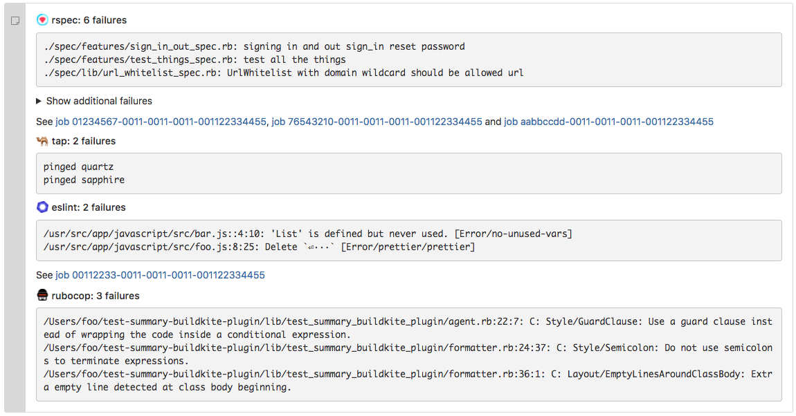
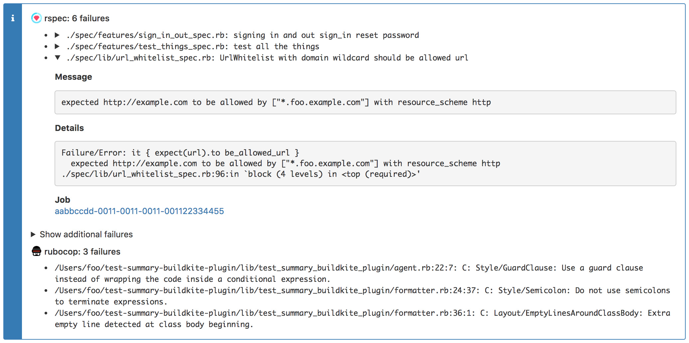

# Test Summary Buildkite Plugin

A [Buildkite plugin](https://buildkite.com/docs/agent/v3/plugins) that adds a single annotation
for all your test failures using
[buildkite-agent annotate](https://buildkite.com/docs/agent/v3/cli-annotate).

Supported formats:

* JUnit
* Checkstyle
* [TAP](https://testanything.org)^
* Plain text files with one failure per line

\^ Current TAP support is fairly limited. If you have an example TAP file that is not being interpreted correctly,
feel free to open an issue or pull request.

## Example

Upload test results as artifacts using any supported format. If you include the `$BUILDKITE_JOB_ID` in the path,
a link to the build will be included in the annotation.
Some examples:

```yaml
steps:
  - label: rspec
    command: rspec
    parallelism: 10
    # With spec_helper.rb:
    # RSpec.configure do |config|
    #   config.add_formatter('RspecJunitFormatter', "artifacts/rspec-#{ENV['BUILDKITE_JOB_ID']}.xml")
    # end
    artifact_paths: "artifacts/*"

  - label: eslint
    command: yarn run eslint -f checkstyle -o artifacts/eslint.xml
    artifact_paths: "artifacts/*"

  - label: ava
    command: bash -c "yarn --silent test --tap > artifacts/ava.tap"
    artifact_paths: "artifacts/*"

  - label: rubocop
    # The emacs format is plain text with one failure per line
    command: rubocop -f emacs -o artifacts/rubocop.txt
    artifact_paths: "artifacts/*"
```

Wait for all the tests to finish:

```yaml
  - wait: ~
    continue_on_failure: true
```

Add a build step using the test-summary plugin:

```yaml
  - label: annotate
    plugins:
      - bugcrowd/test-summary#v1.11.0:
          inputs:
            - label: rspec
              artifact_path: artifacts/rspec*
              type: junit
            - label: eslint
              artifact_path: artifacts/eslint.xml
              type: checkstyle
            - label: ava
              artifact_path: artifacts/ava.tap
              type: tap
            - label: rubocop
              artifact_path: artifacts/rubocop.txt
              type: oneline
          formatter:
            type: details
          context: test-summary
```

See buildkite annotation of all the failures. There are some example annotations included below.

## Configuration

### Inputs

The plugin takes a list of input sources. Each input source has:

* `label:` the name used in the heading to identify the test group.
* `artifact_path:` a glob used to download one or more artifacts.
* `type:` one of `junit`, `checkstyle`, `tap` or `oneline`.
* `encoding:` The file encoding to use. Defaults to `UTF-8`.
* `strip_colors:` Remove ANSI color escape sequences. Defaults to `false`.
* `crop:` (`oneline` type only) Number of lines to crop from the start and end of the file,
  to get around default headers and footers. Eg:

```yaml
crop:
  start: 3
  end: 2
```

* `job_id_regex:` Ruby regular expression to extract the `job_id` from the artifact path. It must contain
  a named capture with the name `job_id`. Defaults to
  `(?<job_id>[0-9a-f]{8}-[0-9a-f]{4}-[0-9a-f]{4}-[0-9a-f]{4}-[0-9a-f]{12})`.

#### Junit specific options:

* `summary:` Customise how the summary is generated. Includes:
    * `format:` A ruby format string for converting the junit xml attributes
      into a summary. All attributes are available in `<element>.<attr-name>` format.
    * `details_regex:` A ruby regular expression, run over the body text of each failure. Any named captures
      generated by this regex will be available to the format string. This is useful if some information is only
      available in the contents of the failure. Eg:

```yaml
summary:
  format: '%{testsuites.name}: %{testsuite.name}: %{testcase.classname}: %{failure.message}%{error.message}'
```

```yaml
summary:
  format: '%{location}: %{testcase.name}'
  details_regex: '(?<location>\S+:\d+)'
```

* `message:` Set this to false if the failure `message` attribute is not worth showing in the annotation. Defaults to `true`.
* `details:` Set this to false if the body of the failure is not worth showing in the annotation. Defaults to `true`.

### Formatter

There are two formatter types, `summary` and `details`.

The `summary` formatter includes a single line for each failure.



The `details` formatter
includes extra information about the failure in an accordion (if available).
This is the default option.



Other formatter options are:

* `show_first:` The number of failures to show before hiding the rest inside an accordion.
  If set to zero, all failures will be hidden by default. If set to a negative number, all failures
  will be shown. Defaults to 20.

### Other options

* `context:` The Buildkite annotation context. Defaults to `test-summary`.
* `style:` Set the annotation style. Defaults to `error`.
* `fail_on_error:` Whether the command should return non-zero exit status on failure. Defaults to `false` so failing
  to annotate a build does not cause the entire pipeline to fail.
  
## Truncation

Buildkite has a maximum annotation size of 100 kilobytes. If there are too many failures to fit within this limit, the
plugin will truncate the failures for each input.

## Developing

To run the tests:

    docker-compose run --rm test rspec

If you have ruby set up, you can just run:

    bundle install
    rspec

To generate sample markdown and HTML based on the files in `spec/sample_artifacts`:

    bin/run-dev

Note: The sample HTML files use hardcoded references to buildkite assets. If the page is not displaying correctly,
try updating the css files in [templates/test_layout.html.haml](templates/test_layout.html.haml) based on what
buildkite is currently serving.
