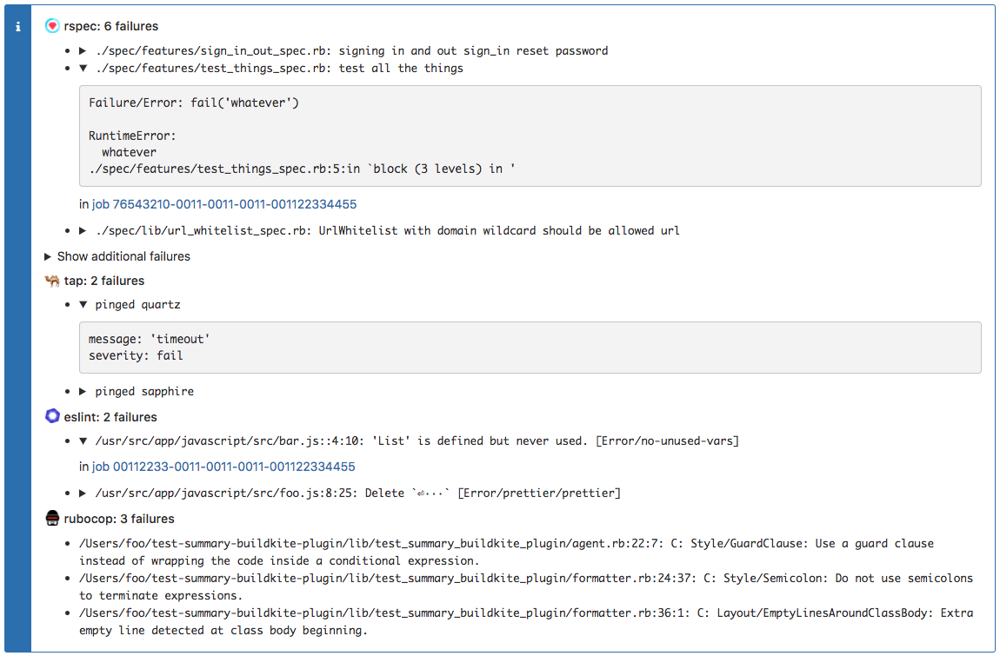

# Test Summary Buildkite Plugin

A [Buildkite plugin](https://buildkite.com/docs/agent/v3/plugins) that adds a single annotation
for all your test failures using
[buildkite-agent annotate](https://buildkite.com/docs/agent/v3/cli-annotate).

Supported formats:

* JUnit
* [TAP](https://testanything.org)
* Plain text files with one failure per line

## Example

Upload test results as artifacts using any supported format. Some examples:

```yaml
steps:
  - label: rspec
    command: rspec
    parallelism: 10
    # With spec_helper.rb:
    # RSpec.configure do |config|
    #   config.add_formatter('RspecJunitFormatter', "artifacts/rspec-#{ENV['BUILDKITE_PARALLEL_JOB']}.xml")
    # end
    artifact_paths: "artifacts/*"

  - label: ava
    command: yarn test --tap -o artifacts/ava.tap
    artifact_paths: "artifacts/*"

  - label: rubocop
    # The emacs format is plain text with one failure per line
    command: rubocop -f emacs -o artifacts/rubocop.txt
    artifact_paths: "artifacts/*"
```

Wait for all the tests to finish:

```yaml
  - wait: ~
    continue_on_failure: true
```

Add a build step using the test-summary plugin:

```yaml
  - label: annotate
    plugins:
      bugcrowd/test-summary#v0.1.0:
        inputs:
          - label: rspec
            artifact_path: artifacts/rspec*
            type: junit
          - label: ava
            artifact_path: artifacts/ava.tap
            type: tap
          - label: rubocop
            artifact_path: artifacts/rubocop.txt
            type: oneline
        formatter:
          type: details
        context: test-summary
```

## Configuration

### Inputs

The plugin takes a list of input sources. Each input source has:

* `label:` the name used in the heading to identify the test group.
* `artifact_path:` a glob used to download one or more artifacts.
* `type:` one of `junit`, `tap` or `oneline`.
* `encoding:` The file encoding to use. Defaults to `UTF-8`.

### Formatter

There are two formatter types, `summary` and `details`.

The `summary` formatter includes a single line for each failure.


The `details` formatter
includes extra information about the failure in an accordion (if available).
This is the default option.



Other formatter options are:

* `show_first:` The number of failures to show before hiding the rest inside an accordion.
  If set to zero, all failures will be hidden by default. If set to a negative number, all failures
  will be shown. Defaults to 20.

### Other options

* `context:` The Buildkite annotation context. Defaults to `test-summary`.
* `style:` Set the annotation style. Defaults to `error`.
